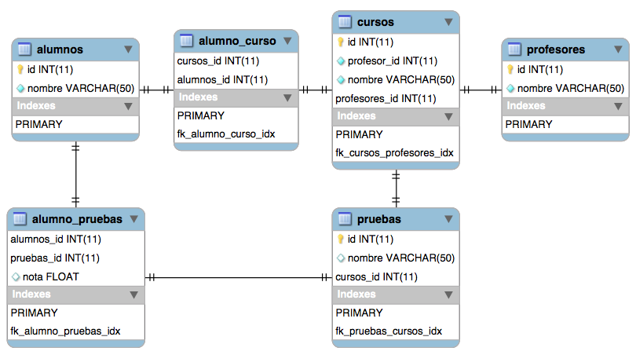

## Test Programación
## Programación

### 1. Escriba una función/método que determine la cantidad de 0’s a la derecha de n! (factorial)

> ### *SOLUCIÓN:*

```javascript
// Factor iterativo
iterativeFactorial (20);    // 2432902008176640000
// Factor Recursivo
recursiveFactorial (20);    // 2432902008176640000
// Ultimos ceros
lastRightZeros(20);         // 4
// Todos los ceros
allRightZeros(20);          // 7
```

> [VER DEMOSTRACÓN](factorial/example/index.html)

> [VER CODIGO FUENTE](factorial/Factorial.ts)

### 2. Escriba una función/método que dado un número entero, entregue su representación en palabras, Ej. 145 ­> `"ciento cuarenta y cinco"`

> ### *SOLUCIÓN:*

```javascript
numberName(1992); // retorna "mil novecientos noventa y dos"
numberName(0);    // retorna "cero"
numberName(21);   // retorna "veintiuno"
```

> [VER DEMOSTRACÓN](numberName/example/index.html)

> [VER CODIGO FUENTE](numberName/numberName.ts)

### 3. Considere un tablero de ajedrez de NxN, realice un algoritmo que visite cada espacio del tablero, usando solamente los movimientos de un caballo. (Puntos extras si se visita cada espacio una sola vez)

> ### *SOLUCIÓN:*

```javascript
	var size = 8;
	// Create game instance
	var game = new Chess(size, 0, 0);
	// Solve game
	game.solve();
	// Get solutions
	game.getSolutions()
```
> [VER DEMOSTRACÓN](chess/example/index.html)

> [VER CODIGO FUENTE](chess/Chess.ts)

## Modelo de datos

### 1. Un colegio necesita un sistema para administrar sus cursos. El sistema tiene que suportar que se le ingresen varios cursos. Cada curso tendrá un profesor a cargo y una serie de alumnos inscritos. Cada profesor, así como cada alumno puede estar en más de un curso. Además cada curso tendrá una cantidad no determinada de pruebas, y el sistema debe permitir ingresar la nota para cada alumno en cada prueba. Todas las pruebas valen lo mismo.
### Escriba a continuación las tablas que utilizaría para resolver este problema con los campos y llaves de éstas. Intente hacer el sistema lo más robusto posible, pero sin incluir datos adicionales a los que se plantean acá.
> ### *SOLUCIÓN:*

> 
> * alumnos
> * profesores
> * cursos
> * pruebas
> * alumno_pruebas
> * alumno_curso

> [VER CODIGO FUENTE](models/model.sql)

### 2. Escriba un Query que entregue la lista de alumnos para el curso `programación`.

> ### *SOLUCIÓN:*

```mysql-sql
SELECT
	alumnos.id,
	alumnos.nombre
FROM
	alumno_curso
INNER JOIN alumnos ON (
	alumnos.id = alumno_curso.alumnos_id
)
WHERE alumno_curso.cursos_id = 3
LIMIT 1000
```

### 3. Escriba un Query que calcule el promedio de notas de un alumno en un curso
> ### *SOLUCIÓN:*

```mysql-sql
SELECT
	ROUND(AVG(alumno_pruebas.nota), 2) AS `promedio`
FROM
	pruebas
INNER JOIN alumno_pruebas ON (
	pruebas.id = alumno_pruebas.pruebas_id
)
WHERE pruebas.cursos_id = 3
AND alumno_pruebas.alumnos_id = 2
LIMIT 1
```

### 4. Escriba un Query que entregue a los alumnos y el promedio que tiene en cada ramo.

> ### *SOLUCIÓN:*

```mysql-sql
SELECT
	alumnos.nombre,
	cursos.nombre,
	ROUND(AVG(alumno_pruebas.nota), 1) as `promedio`
FROM
	alumno_pruebas
INNER JOIN pruebas ON (
	pruebas.id = alumno_pruebas.pruebas_id
)
INNER JOIN cursos ON (
	cursos.id = pruebas.cursos_id
)
INNER JOIN alumnos ON(
	alumnos.id = alumno_pruebas.alumnos_id
)
GROUP BY cursos.id, alumnos.id
LIMIT 1000
```

### 5. Escriba un Query que lista a todos los alumnos con más de un ramo con promedio rojo.

> ### *SOLUCIÓN:*

```mysql-sql
SELECT
	rojos.alumno_nombre
FROM (
	SELECT
		alumnos.id as `alumno_id`,
		alumnos.nombre AS `alumno_nombre`,
		ROUND(AVG(alumno_pruebas.nota), 1) as `promedio`
	FROM
		alumno_pruebas
	INNER JOIN pruebas ON (pruebas.id = alumno_pruebas.pruebas_id)
	INNER JOIN alumnos ON(alumnos.id = alumno_pruebas.alumnos_id)
	GROUP BY pruebas.cursos_id, alumnos.id
	HAVING promedio < 4
) AS `rojos`
GROUP BY rojos.alumno_id
HAVING COUNT( rojos.alumno_id ) > 1
LIMIT 1000
```

### 6. Se tiene una tabla con información de jugadores de tenis:
PLAYERS(Nombre, Pais, Ranking)
Suponga que Ranking es un número de 1 a 100, que es distinto para cada jugador.
Si la tabla en un momento dado tiene solo 20 tuplas, indique cuantas tuplas tiene la tabla que resulta de la siguiente consulta:
SELECT c1.Nombre, c2.Nombre FROM PLAYERS c1, PLAYERS c2 WHERE c1.Ranking > c2.Ranking

> ### *SOLUCIÓN:*
> `190`


## Diseño

### 1. Si usted estuviera resolviendo el problema del colegio con programación orientada a objetos, defina que clases usaría, métodos y las variables de estas clases. Puede utilizar el lenguaje que más le acomode o bien pseudos código.
> ### *SOLUCIÓN:*

### 2. Diseñe un mazo de cartas (orientado a objetos) con propiedades y métodos básicos que considere para ser utilizado en distintas aplicaciones que utilicen cartas.

> ### *SOLUCIÓN:*
```javascript
// El juego se llama "Mi Juego de Cartas"
// El mazo de carta consta de 30 cartas iniciales.
var juego = new Juego("Mi Juego de Cartas", 30);
// Pedro(id:1) parte con 5 cartas al azar tomadas del mazo
// Al mazo le quedan 25 cartas disponibles.
juego.agregarJugador(1, "Pedro", 5);
// Jaun(id:2) parte con 5 cartas al azar tomadas del mazo
// Al mazo le quedan 20 cartas disponibles.
juego.agregarJugador(2, "Juan", 5);
// Diego(id:3) parte con 5 cartas al azar tomadas del mazo
// Al mazo le quedan 15 cartas disponibles.
juego.agregarJugador(3, "Diego", 5);
// "Pedro" da una carta a "Juan".
// Ahora "Pedro" tiene 4 cartas y "Juan" 6 cartas.
// El mazo sigue teniendo 15 cartas disponibles.
juego.jugador(1).darCartaAJuagador(2);
// "Diego" roba una carta del mazo.
// Ahora "Diego" tiene 6 cartas.
// Al mazo le quedan 14 cartas disponibles.
juego.jugador(3).tomarCartaDelMazo();
// "Juan" hizo trampa y fue expulsado
// El mazo recupera las cartas de "Juan"(6 cartas)
juego.expulsarJugador(2)
```

> [VER CODIGO FUENTE](cards/Cards.ts)

### 3. Diseño código frontend
> ### *SOLUCIÓN:*

```javascript
var calendar = new Calendar(citas, {
	step    : 30,
	headers : [
		'Lunes 09',
		'Martes 10',
		'Miercoles 11',
		'Jueves 12',
		'Viernes 13',
		'Sabado 14',
		'Domingo 15'
	]
});
calendar.draw(document.getElementById('calendar'))
```
> [VER DEMOSTRACIÓN](calendar/example/index.html)

> [VER CODIGO FUENTE](calendar/Calendar.ts)